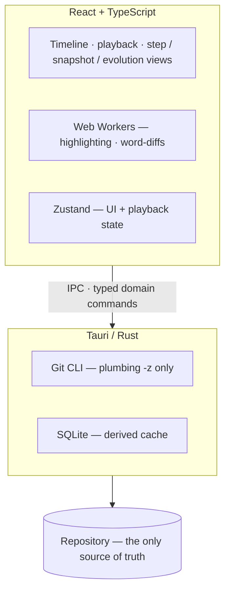

# Git Replay

**A development timelapse player — watch how a codebase was built.**

[](LICENSE)
[](https://github.com/<owner>/git_replay/actions)

Open a repository, pick what to watch (branch, commits, releases, PR, or
everything), and press Play: each commit becomes a frame. See what changed at
every step, browse the full snapshot at any point in history, and follow a
single file through its whole life. Local-first — nothing ever leaves your
machine.

## Install

Download an installer from [GitHub Releases](https://github.com/<owner>/git_replay/releases) —
every `v*` tag is built automatically by CI:

| Platform | Packages |
|----------|----------|
| Windows | `.msi`, `.exe` (NSIS) |
| macOS | `.dmg` (x64 + arm64) |
| Linux | `.deb`, `.AppImage` (needs system Git) |

A `SHA256SUMS.txt` manifest ships with each release. macOS builds are ad-hoc
signed for now — right-click → Open on first launch.

## Architecture



- **Git owns history.** System Git CLI, plumbing commands, machine-readable output.
- **Rust interprets it.** Typed domain models cross the IPC boundary — never raw shell output.
- **SQLite accelerates.** A derived cache; deleting it degrades to recomputation, never data loss.
- **Workers polish.** Syntax highlighting and word-level diffs stay off the React main thread.
- **React renders time.**

No backend. No Postgres. Fully offline.

## Development

Prerequisites: Node.js 20+, Rust stable, system Git. From the repo root:

```sh
make dev          # run the app
make check        # lint + build + all tests
make selftest     # the app with its in-app end-to-end audit
make kill         # kill a running app (it locks cargo builds)
make release      # installers
```

Full list with `make` (or `make help`): build, test, test-engine, lint, fix,
check, selftest, kill, release. The same scripts exist under `apps/desktop`.

### Try it

Any repository works — including this one. For a curated tour:

```sh
sh scripts/make-demo-fixture.sh   # 14-commit demo: merge, rename, binary, tags
```

Then in the app: open `fixtures/demo-repo` → replay **main** → select
`src/worker.ts` → File story (`3`) and watch one file grow.

### Keyboard

| Keys | Action |
|------|--------|
| `←` / `→` | previous / next commit |
| `Shift+←` / `Shift+→` | jump 5 commits |
| `Space` | play / pause |
| `1` / `2` / `3` / `4` | What changed / Browse code / File story / Overview |
| `/` | search |
| `Ctrl+K` | command palette |

### Capabilities

- **Replay sources**: branch (merge-base aware), commit range, tags/releases,
  GitHub PR (force-push versions via `gh`), entire repository
- **Working Tree frame**: uncommitted staged + unstaged changes as a final frame
- **Change map**: file × commit activity grid
- **Adaptive playback**: small commits flash by, substantial ones pause; manual stepping always works
- **Chapters**: heuristic grouping as an alternate presentation — raw commits always visible
- **Search**: commit messages, paths, and changed content (pickaxe)
- **Repository watch**: refresh banner on new commits or branch switches
- **Session restore**: resume the last replay from the welcome screen

## Product invariants

1. Git is authoritative.
2. Replay is the primary product.
3. Raw Git history is always accessible — never silently rewritten or hidden.
4. Core functionality works offline.
5. Deleting the cache never deletes repository information.
6. Previous/Next navigation feels instantaneous.
7. Large repositories never block the UI thread.

## Open source

MIT licensed. Community files: [CONTRIBUTING.md](CONTRIBUTING.md),
[CODE_OF_CONDUCT.md](CODE_OF_CONDUCT.md), [SECURITY.md](SECURITY.md),
[SUPPORT.md](SUPPORT.md). Design lives in [docs/architecture.md](docs/architecture.md)
and [docs/decisions/](docs/decisions/) — start there to contribute.
