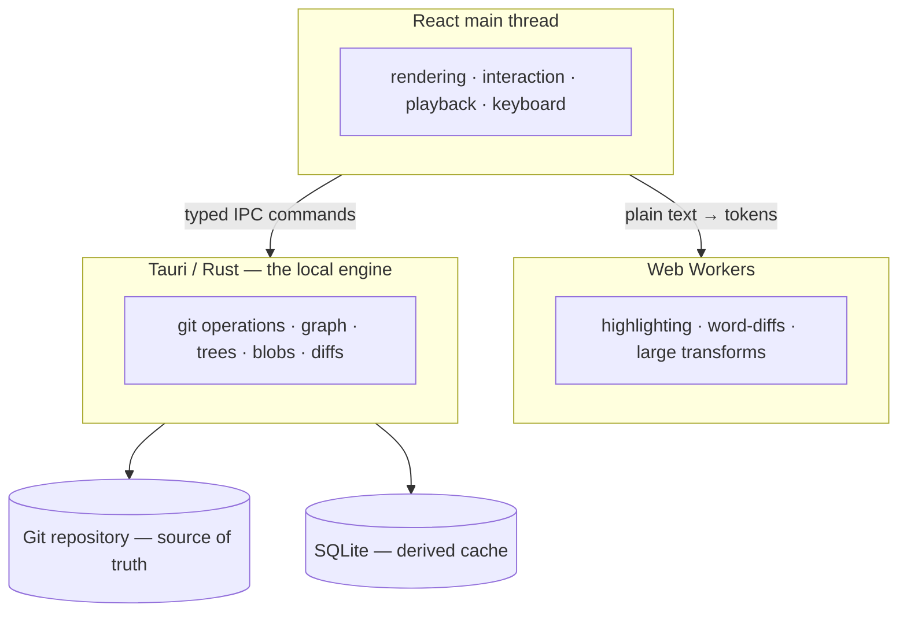

# Architecture

## Overview

Git Replay answers one question: *how did this codebase get from state A to
state B?* Four layers, strict boundaries:

## Layer contracts

### Git → Rust

The engine shells out to the system Git CLI using **plumbing commands with `-z`
(NUL-separated) output** exclusively. Human-formatted output is never parsed.

| Concern          | Commands                                                            |
|------------------|---------------------------------------------------------------------|
| Refs / resolve   | `rev-parse`, `merge-base`                                           |
| History          | `rev-list --topo-order`, `log -z --format=...`                      |
| File changes     | `diff-tree -r --root -M -C --name-status -z`, `diff-tree --numstat -z` |
| Stats            | `diff-tree --shortstat`                                             |
| Patches          | `diff-tree -r -p --root -M`                                         |
| Snapshots        | `ls-tree -l -z <tree-sha>`, `cat-file`                              |
| Evolution        | `log --follow --raw/--numstat -z` (rename chains via git)           |
| Search           | `log --grep --fixed-strings`, pathspec globs, `-S` pickaxe          |
| Working tree     | `diff HEAD`, `ls-files --stage/--others`, `rev-parse :path`         |
| Pull requests    | `gh pr view` / `gh api graphql` (force-push events), `git fetch`    |

Semantics worth knowing:

- **Commit ordering is topological** (`--topo-order`), never timestamp order —
  dates can lie (rebases, cherry-picks, clock skew); ancestry cannot.
- **Root commits** diff against the empty tree via `--root`.
- **Merge commits** diff against an explicit parent (first by default,
  user-selectable) — never the combined diff.
- **Renames/copies** use git's own `-M -C` detection; the app never invents continuity.
- **Tree listings are content-addressed** by tree SHA — no pathspec escaping, cacheable by SHA.
- **Working-tree frames are synthetic** (`diff HEAD` + index listings), and exist
  only while the replay head is the repo's HEAD.
- **PR replays** fetch `refs/pull/N/head` and feed the same resolve path as local
  refs; force-push versions come from GitHub's `HEAD_REF_FORCE_PUSHED` timeline events.
- **Chapters** are a pure presentation heuristic over raw commits — the raw
  timeline is always one toggle away.

### Rust → React

Tauri commands expose typed domain models — React never sees raw shell output.
Frames are `[base] + commits` in topological order: frame 0 is the baseline
snapshot, frames 1..N are commits. Heavy operations (`resolve_replay`,
`get_snapshot_stats`, `get_file_evolution`, `search_replay`) run in
`spawn_blocking` so the IPC thread never blocks.

### React → Workers

Presentation-only CPU work — hljs syntax highlighting and word-level diffing —
runs in a Web Worker as token runs (class stacks + text, never HTML). The main
thread only renders React elements.

## Caching

SQLite at the OS cache dir, keyed by canonical repo path: `commits` by SHA,
`file_changes` per (sha, parent), `diffs` per (sha, parent, path), `blobs` by
blob SHA, `trees` by tree SHA, plus derived `stats`/`evolution` aggregates.
Everything is derived — deleting the database degrades to recomputation, never
to data loss. The frontend adds an in-memory cache and prefetches frames around
the playhead so stepping feels instantaneous.

## Testing

- **Engine** (`cargo test`, 56 tests): fixtures are real repositories built by
  the git CLI in temp dirs — linear, merge, rename, copy, binary, symlink,
  gitlink, tags, skewed dates, working-tree edits, a 500-commit history.
  Invariants are checked against git's own output (snapshot == `ls-tree`,
  diff == `git diff`, …) plus cache-deletion invariance.
- **UI** (`npm test`, vitest): store frame math and playback boundaries, the
  unified-diff parser, chapter heuristics, the markdown parser, formatting.
- **In-app audit**: `make selftest` drives the real app through every view,
  shortcut, and edge case (44 steps, run from CI locally).

## Error model

`AppError` maps git/io failures to user-meaningful messages with raw git
stderr kept in a `detail` field for "Show details" surfaces.

## Known trade-offs

- System Git CLI is required (ADR-0002); no libgit2 dependency.
- Commit messages split on ASCII `0x1f`; a message containing it truncates there.
- Paths assumed UTF-8; non-UTF-8 paths display lossy.
- Adaptive playback uses stats already in the prefetch cache — falls back to the
  fixed rate, never worse.
- Huge timelines aggregate into day-buckets; the canvas never creates DOM nodes
  per commit.
- PR force-push versions depend on what GitHub still lets you fetch; garbage-collected
  versions report a clear "no longer fetchable" error.
- Repository-change detection polls HEAD every 4s while visible rather than
  watching the filesystem.
